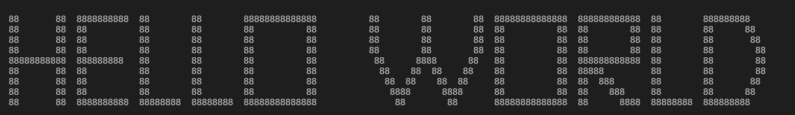

# [Terminal Print C](https://www.github.com/niyoj/terminal_print_C)
Terminal Print in C is a project that can be used to print the string in the terminal dynamically. Here printing the string means printing it with the help of arrays of characters as shown in the picture below;



The main objectives of the project are;
- To style the text in terminal without use of heavy libraries,
- To dynamically print the text using array of characters, and,
- To practice C-programming and implementing it in real projects.

## File Hierarchy Explained
In this repo, you can see the file hierarchy as shown below;
```
.
├── bin
├── docs
├── .gitignore
├── README.md
└── terminal.c

```

and explaining about the filesystem of the project;
- **bin** : It contains all the executable files if you want to test the program.
- **docs** : Consists the documentation, guides and examples for the project. It also contains some images that are used in the project.
- **README.md** : Contains the basic insturctions for the project, contributing guideliness etc.
- **terminal.c** : It is the main C file that contains all the necessary function for implmentation of the project.